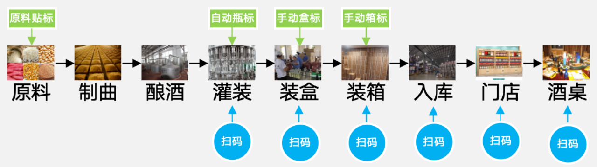
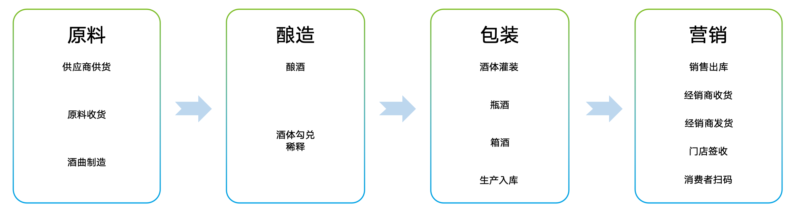
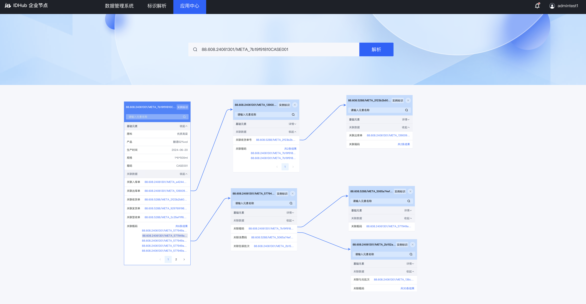

# 项目简介

应用开发者可参照泰尔英福提供的[标识应用开发指南](https://snms.teleinfo.cn/docs/handle-app-sop/1-introduce/purpose)，进行标识应用开发。

本项目描述基于企业节点的服务能力，模拟打通酒行业 从“原料---制曲---酿造……---酒桌”的全业务流程，基于贯通的数据，开发一款标识追溯大屏应用。以下是追溯大屏的介绍：

1. 酒行业追溯大屏
    
    

2. 该追溯大屏，通过企业节点，模拟打通酒行业的全业务流程
    
    

3. 模拟打通 生产系统、仓储系统、营销系统，实现酒行业4个大环节、14个小环节的贯通
    
    

4. 数据接入企业节点，基于企业节点服务能力，形成标识数据关系图
    

5. 从标识数据关系图中，选择一条数据链路，设计追溯路径

6. 调用标识解析接口，获取已选的数据链路上的有访问权限的标识数据，并进行解析数据的展示

# 3 技术选型

当前酒业溯源的演示项目采用的是前后端分离的开发+部署模式，

## 3.1 后端技术

| 技术+版本 | 说明 | 官网 |
| --- | --- | --- |
| Spring Boot | 容器+MVC框架 | [https://spring.io/projects/spring-boot](https://spring.io/projects/spring-boot) |
| Docker | 应用容器引擎 | [https://www.docker.com/](https://www.docker.com/) |
| Lombok | 简化对象封装工具 | [https://github.com/rzwitserloot/lombok](https://github.com/rzwitserloot/lombok) |

## 3.2 前端技术

| 技术 | 说明 | 官网 |
| --- | --- | --- |
| Vue3 | 前端框架 | [https://vuejs.org/](https://vuejs.org/) |
| Vue-router | 路由框架 | [https://router.vuejs.org/](https://router.vuejs.org/) |
| Vuex | 全局状态管理框架 | [https://vuex.vuejs.org/](https://vuex.vuejs.org/) |
| @tele-design/web-vue | 前端UI框架 | [http://tele-design-vue.prod.idx.space/vue/docs/start](http://tele-design-vue.prod.idx.space/vue/docs/start) |
| Axios | 前端HTTP框架 | [https://github.com/axios/axios](https://github.com/axios/axios) |

## 3.3 开发工具

| 工具 | 说明 | 官网 |
| --- | --- | --- |
| IDEA | 开发IDE | [https://www.jetbrains.com/idea/download](https://www.jetbrains.com/idea/download) |
| RedisDesktop | redis客户端连接工具 | [https://redisdesktop.com/download](https://redisdesktop.com/download) |
| Navicat | 数据库连接工具 | [http://www.formysql.com/xiazai.html](http://www.formysql.com/xiazai.html) |
| PowerDesigner | 数据库设计工具 | [http://powerdesigner.de/](http://powerdesigner.de/) |
| figma | 原型设计工具 | [https://www.figma.com/](https://www.figma.com/) |
| ProcessOn | 流程图绘制工具 | [https://www.processon.com/](https://www.processon.com/) |

## 3.4 开发环境
| 工具 | 版本号 | 下载 |
| --- | --- | --- |
| JDK | 1.8 | [https://www.oracle.com/technetwork/java/javase/downloads/jdk8-downloads-2133151.html](https://www.oracle.com/technetwork/java/javase/downloads/jdk8-downloads-2133151.html) |
| Mysql | 5.7 | [https://www.mysql.com/](https://www.mysql.com/) |
| nginx | 1.10 | [http://nginx.org/en/download.html](http://nginx.org/en/download.html) |

